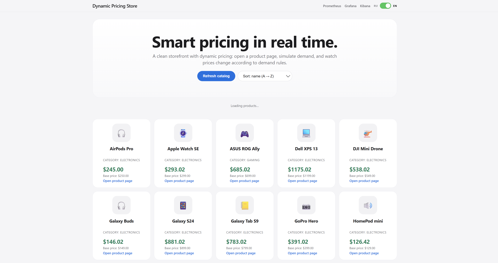
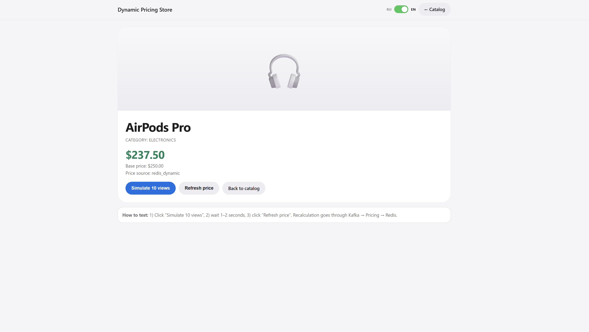
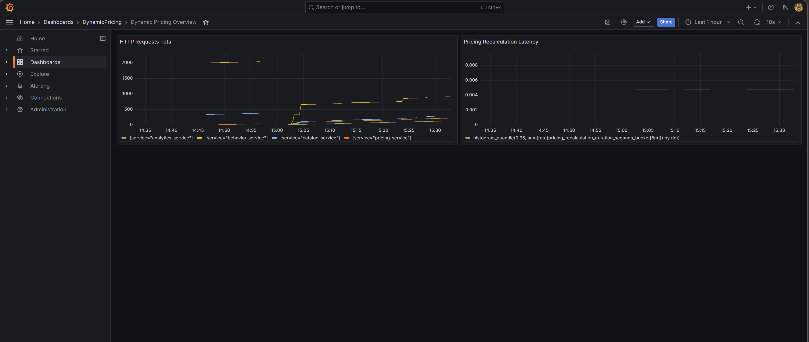

# Real-Time Dynamic Pricing Platform

Платформа динамического ценообразования в реальном времени (production-style):
пользовательские события идут через Kafka, цена пересчитывается в `pricing-service`,
кэшируется в Redis и отдается в UI/API.

## Скриншоты системы

Каталог:



Страница товара:



Мониторинг:



## Что внутри

- Go микросервисы: `catalog-service`, `behavior-service`, `pricing-service`, `analytics-service`
- Kafka (event bus)
- Redis (кэш цен)
- PostgreSQL (основные данные)
- MongoDB (аналитика и история)
- Docker Compose для локального запуска
- Kubernetes манифесты и Jenkins pipeline

## Требования

Перед запуском нужно:

- Docker Desktop (Windows/Mac) или Docker Engine (Linux)
- В Docker Desktop должен быть статус **Engine running**

Проверка:

```bash
docker version
docker compose version
```

## Запуск с нуля (если скачали с GitHub)

```bash
git clone https://github.com/mardvsh/Real-time-dynamic-pricing-platform.git
cd "Real-Time Dynamic Pricing Platform"
docker compose up --build -d
```

После первого запуска проверьте:

```bash
docker compose ps
```

## Куда заходить в браузере

- UI (каталог): `http://localhost:8080`
- Страница товара: `http://localhost:8080/product.html?id=1`

Переключение языка в UI:

- в правом верхнем углу есть тумблер `RU/EN` (видно текущий выбранный язык)
- язык применяется на главной и на странице товара

На главной странице каталога доступны:

- кнопка `Обновить каталог`
- сортировка по названию и по цене (в обе стороны)

API/health:

- `http://localhost:8081/health` (catalog)
- `http://localhost:8082/health` (behavior)
- `http://localhost:8083/health` (pricing)
- `http://localhost:8084/health` (analytics)

## Как проверить, что динамическая цена работает

В каталоге уже 20+ товаров (сейчас 22), чтобы интерфейс выглядел как полноценная витрина.

Если проект был запущен раньше и база уже существовала, примените миграцию с товарами вручную:

```bash
docker compose exec -T postgres psql -U postgres -d dynamic_pricing -f /docker-entrypoint-initdb.d/002_add_more_products.sql
```

На странице товара:

1. Откройте `http://localhost:8080/product.html?id=1`
2. Нажмите **Симулировать 10 просмотров**
3. Через 1–2 секунды нажмите **Обновить цену**

Чтобы увидеть авто-остывание цены:

1. Поднимите цену симуляцией на странице товара
2. Ничего не нажимайте ~1–2 минуты
3. Нажмите **Обновить цену** — цена начнет плавно снижаться

## Новая логика ценообразования

Сейчас в `pricing-service` есть:

- автоматическое остывание цены по таймеру (без новых событий)
- минимальные и максимальные границы цены

Границы считаются от базовой цены товара:

- `min_price = base_price * PRICING_MIN_MULTIPLIER`
- `max_price = base_price * PRICING_MAX_MULTIPLIER`

По умолчанию:

- `PRICING_MIN_MULTIPLIER=0.70`
- `PRICING_MAX_MULTIPLIER=1.50`
- `PRICING_COOLING_INTERVAL=15s`
- `PRICING_COOLING_STEP_PCT=0.01` (1% от базовой цены за тик)
- `PRICING_DYNAMIC_TTL=30s`

### Минимальная и максимальная цена

Для каждого товара границы считаются от `base_price`:

- `min_price = base_price * PRICING_MIN_MULTIPLIER`
- `max_price = base_price * PRICING_MAX_MULTIPLIER`

Текущие дефолты:

- `PRICING_MIN_MULTIPLIER=0.70` (минимум 70% от базовой)
- `PRICING_MAX_MULTIPLIER=1.50` (максимум 150% от базовой)

Примеры:

- PlayStation 5 (`500`) → `350..750`
- AirPods Pro (`250`) → `175..375`
- MacBook Air (`1300`) → `910..1950`

## Где менять настройки и правила

### 1) Через `docker-compose` (без изменений кода)

Меняйте переменные в [docker-compose.yml](docker-compose.yml) в секции `pricing-service.environment`:

- `PRICING_MIN_MULTIPLIER`
- `PRICING_MAX_MULTIPLIER`
- `PRICING_COOLING_INTERVAL`
- `PRICING_COOLING_STEP_PCT`
- `PRICING_DYNAMIC_TTL`

После изменения:

```bash
docker compose up --build -d pricing-service
```

### 2) Изменить формулу спроса (код)

Файл правил: [services/pricing-service/internal/rules.go](services/pricing-service/internal/rules.go)

### 3) Изменить механику авто-остывания и clamp (код)

Файл: [services/pricing-service/internal/app.go](services/pricing-service/internal/app.go)

- `StartAutoCooling`
- `applyAutoCooling`
- `coolDownProduct`
- `clampByBase`

## Как остановить

Остановить контейнеры, но оставить данные:

```bash
docker compose stop
```

Полностью остановить и удалить контейнеры/сеть:

```bash
docker compose down
```

Полный сброс (включая БД и кэш):

```bash
docker compose down -v
```

## Как запустить заново

После `stop`:

```bash
docker compose start
```

После `down`:

```bash
docker compose up -d
```

После изменений в коде:

```bash
docker compose up --build -d
```

## Полезные команды

Логи всех сервисов:

```bash
docker compose logs -f
```

Логи только pricing:

```bash
docker compose logs -f pricing-service
```

Статус контейнеров:

```bash
docker compose ps
```

## Мониторинг: что открывать и что делать внутри

Сначала поднимите нужные профили:

```bash
docker compose --profile obs up -d
docker compose --profile elk up -d
```

### Prometheus (`http://localhost:9090`)

Зачем: смотреть сырые метрики и выполнять PromQL-запросы.

Если видите `No data queried yet` — это нормально, просто введите запрос и нажмите `Execute`.

Готовые запросы:

```promql
sum(rate(http_requests_total[5m])) by (service)
```

```promql
histogram_quantile(0.95, sum(rate(pricing_recalculation_duration_seconds_bucket[5m])) by (le))
```

```promql
sum(http_requests_total) by (service, status)
```

### Grafana (`http://localhost:3000`)

Зачем: готовые графики/дашборды поверх Prometheus.

1. Логин: обычно `admin / admin`
2. Откройте дашборд `Dynamic Pricing Overview`
3. Сгенерируйте трафик в UI (`http://localhost:8080`) и обновите дашборд

### Kibana (`http://localhost:5601`)

Зачем: поиск и анализ логов в Elasticsearch.

1. Нажмите `Explore on my own`
2. Перейдите в `Discover`
3. Создайте Data View: `dynamic-pricing-logs-*`
4. В `Discover` выберите этот Data View и смотрите логи контейнеров

В проекте уже настроен импорт логов в Elasticsearch через `filebeat -> logstash -> elasticsearch`.
Логи приложений и инфраструктуры идут в индекс `dynamic-pricing-logs-YYYY.MM.dd`.

## Если не запускается

### Ошибка про `dockerDesktopLinuxEngine`

1. Запустите Docker Desktop
2. Дождитесь `Engine running`
3. Выполните:

```bash
wsl --shutdown
docker compose up --build -d
```

### Сервисы упали при старте

Проверьте логи:

```bash
docker compose logs --tail=200 catalog-service behavior-service pricing-service analytics-service
```

## Архитектура (кратко)

`behavior-service` → Kafka (`user-events`, `analytics-events`) → `pricing-service` и `analytics-service`

- `pricing-service` пересчитывает цену и обновляет Redis
- `catalog-service` отдает товар с текущей динамической ценой
- `analytics-service` сохраняет события и обновления цен в MongoDB

---

# English Quick Guide

## What this project is

Real-time dynamic pricing platform built with Go microservices, Kafka, Redis, PostgreSQL, MongoDB, Docker Compose, Kubernetes manifests, Jenkins pipeline, and monitoring via Prometheus/Grafana/Kibana.

## Quick start

```bash
git clone https://github.com/<username>/real-time-dynamic-pricing-platform.git
cd "Real-Time Dynamic Pricing Platform"
docker compose up --build -d
```

Check status:

```bash
docker compose ps
```

## URLs

- Storefront: `http://localhost:8080`
- Product page: `http://localhost:8080/product.html?id=1`
- Health endpoints: `8081..8084`

Monitoring:

```bash
docker compose --profile obs up -d
docker compose --profile elk up -d
```

- Prometheus: `http://localhost:9090`
- Grafana: `http://localhost:3000`
- Kibana: `http://localhost:5601`

## UI language switch

Use the `RU/EN` toggle in the top-right corner to switch between Russian and English (the active language is visually highlighted).

## Stop and start again

Pause containers:

```bash
docker compose stop
```

Stop and remove containers/network:

```bash
docker compose down
```

Start again:

```bash
docker compose up -d
```
